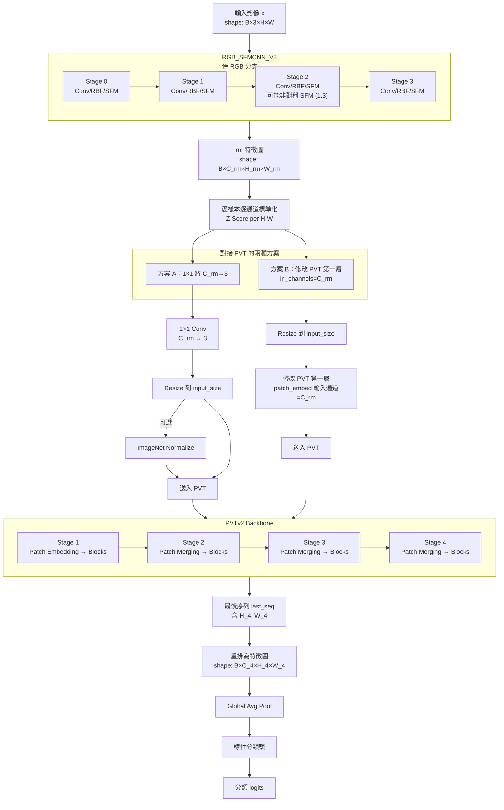

## RGB_SFM_PVT 流程圖（使用 RGB_SFMCNN_V3 → PVT）

> 說明：先以可解釋 RM（RGB_SFMCNN_V3）抽特徵，再銜接 PVT（兩種串接方案）。

### 重點
- SFM 的空間合併僅發生在 RM（RGB_SFMCNN_V3）內，可能導致 `H_rm`、`W_rm` 不等（長方形）。
- 進入 PVT 前：
  - 方案 A：1×1 壓到 3 通道後 resize（可選 ImageNet Norm）。
  - 方案 B：改 PVT 第一層 `patch_embed` 的輸入通道為 `C_rm`，直接吃 RM 特徵（仍需 resize）。
- PVT 內部的 patch merging 保持原版 PVTv2 設計不變（與 SFM 無衝突）。

### 與可視化對應
- `pvt_forward_response_plot.py` 會輸出：
  - RM 各 Stage 的特徵熱圖（均值與若干通道）。
  - PVT 各 Stage 的特徵熱圖（均值、通道格子、通道統計）。
  - 最終預測與 Ground Truth，以及原圖。

