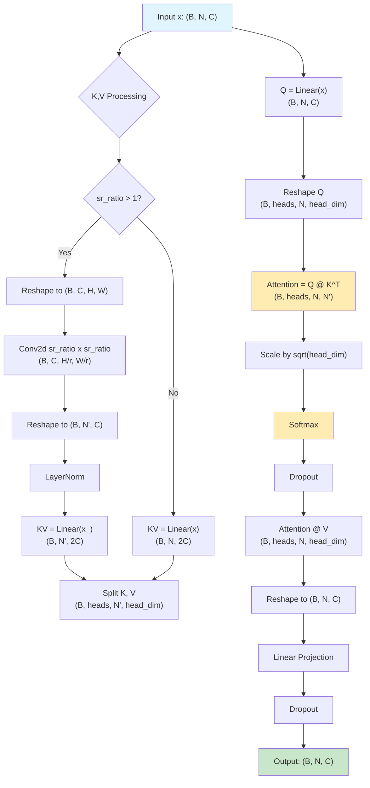

# PVT (Pyramid Vision Transformer) 流程圖

```mermaid
graph TD
    A["Input Image<br/>Bx3xHxW"] --> B{"Channel Adapter?"}
    B -->|"in_channels != 3"| C["Conv2d 1x1<br/>Bx3xHxW"]
    B -->|"in_channels = 3"| D["Direct Input"]
    C --> E["Resize to input_size<br/>Bx3x224x224"]
    D --> E
    
    E --> F["Stage 1: Patch Embedding"]
    F --> G["OverlapPatchEmbed<br/>kernel=7, stride=4, pad=3<br/>Bx64x56x56"]
    
    G --> H["Stage 1 Blocks"]
    H --> I["Block 1: SRA + MLP<br/>heads=1, sr_ratio=8"]
    I --> J["Block 2: SRA + MLP<br/>heads=1, sr_ratio=8"]
    
    J --> K["LayerNorm + Reshape<br/>Bx64x56x56"]
    K --> L["Stage 1 Output<br/>Feature Map 1"]
    
    K --> M["Stage 2: Patch Embedding"]
    M --> N["OverlapPatchEmbed<br/>kernel=3, stride=2, pad=1<br/>Bx128x28x28"]
    
    N --> O["Stage 2 Blocks"]
    O --> P["Block 1: SRA + MLP<br/>heads=2, sr_ratio=4"]
    P --> Q["Block 2: SRA + MLP<br/>heads=2, sr_ratio=4"]
    
    Q --> R["LayerNorm + Reshape<br/>Bx128x28x28"]
    R --> S["Stage 2 Output<br/>Feature Map 2"]
    
    R --> T["Stage 3: Patch Embedding"]
    T --> U["OverlapPatchEmbed<br/>kernel=3, stride=2, pad=1<br/>Bx320x14x14"]
    
    U --> V["Stage 3 Blocks"]
    V --> W["Block 1: SRA + MLP<br/>heads=5, sr_ratio=2"]
    W --> X["Block 2: SRA + MLP<br/>heads=5, sr_ratio=2"]
    
    X --> Y["LayerNorm + Reshape<br/>Bx320x14x14"]
    Y --> Z["Stage 3 Output<br/>Feature Map 3"]
    
    Y --> AA["Stage 4: Patch Embedding"]
    AA --> BB["OverlapPatchEmbed<br/>kernel=3, stride=2, pad=1<br/>Bx512x7x7"]
    
    BB --> CC["Stage 4 Blocks"]
    CC --> DD["Block 1: SRA + MLP<br/>heads=8, sr_ratio=1"]
    DD --> EE["Block 2: SRA + MLP<br/>heads=8, sr_ratio=1"]
    
    EE --> FF["LayerNorm + Reshape<br/>Bx512x7x7"]
    FF --> GG["Stage 4 Output<br/>Feature Map 4"]
    
    FF --> HH["Global Average Pooling<br/>Bx512x1x1"]
    HH --> II["Flatten<br/>Bx512"]
    II --> JJ["Linear Classifier<br/>Bxnum_classes"]
    JJ --> KK["Output Logits<br/>Bxnum_classes"]
    
    style A fill:#e1f5fe
    style KK fill:#c8e6c9
    style L fill:#fff3e0
    style S fill:#fff3e0
    style Z fill:#fff3e0
    style GG fill:#fff3e0
```

## SRA (Spatial-Reduction Attention) 詳細流程

## 關鍵參數說明

### Stage 配置
- **Stage 1**: C=64, blocks=2, sr_ratio=8, stride=4 → 224x224 → 56x56
- **Stage 2**: C=128, blocks=2, sr_ratio=4, stride=2 → 56x56 → 28x28  
- **Stage 3**: C=320, blocks=2, sr_ratio=2, stride=2 → 28x28 → 14x14
- **Stage 4**: C=512, blocks=2, sr_ratio=1, stride=2 → 14x14 → 7x7

### 注意力頭數 (Auto Schedule)
- 基於 `head_dim_target=64` 自動計算
- Stage 1: 1 head (64/64=1)
- Stage 2: 2 heads (128/64=2)  
- Stage 3: 5 heads (320/64=5)
- Stage 4: 8 heads (512/64=8)

### 空間降採樣 (SR)
- **sr_ratio=8**: K,V 降採樣到 1/8 大小
- **sr_ratio=4**: K,V 降採樣到 1/4 大小
- **sr_ratio=2**: K,V 降採樣到 1/2 大小
- **sr_ratio=1**: 無降採樣，保持原大小

### 計算複雜度
- 原始注意力: O(N²)
- SRA 注意力: O(N x N/r²)
- 其中 N = HxW, r = sr_ratio
